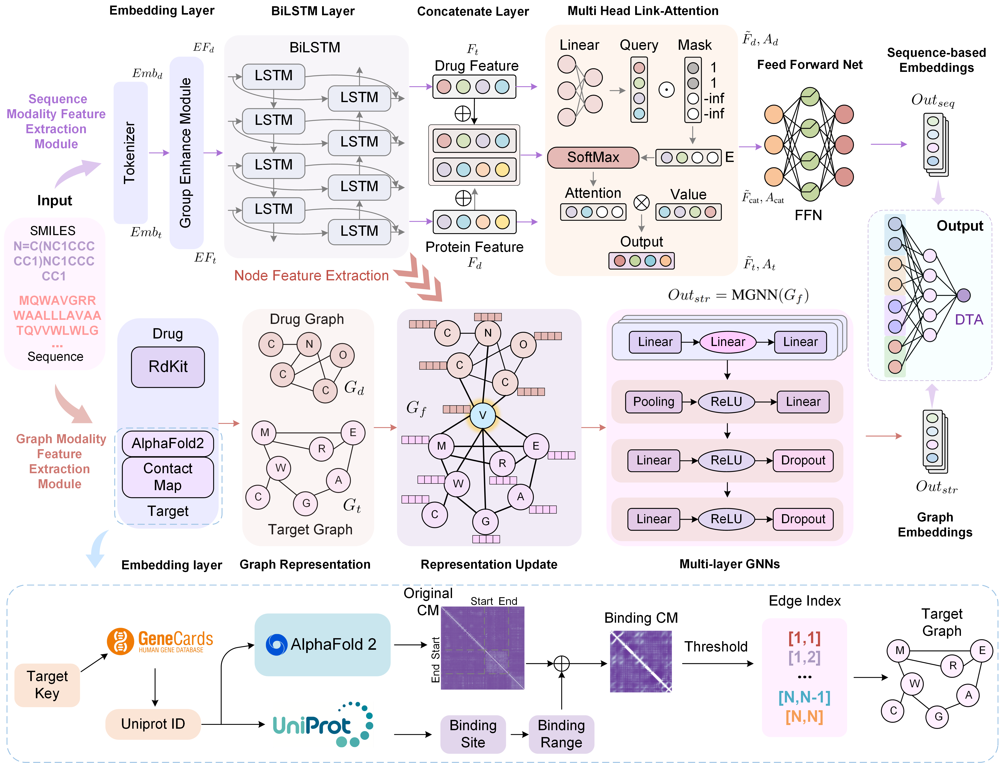

# DMFF-DTA: Dual Modality Feature Fused Neural Network Integrating Binding Site Information for Drug Target Affinity Prediction

DMFF-DTA is an innovative dual-modality neural network model that effectively integrates sequence and structural information from both drugs and targets to achieve accurate drug-target affinity prediction. The model addresses the scale disparity between drug molecules and proteins by introducing a binding site-focused graph construction method based on AlphaFold2.

## Framework


## File list
- Model: The Folder contains the trained model of DMFF-DTA.
- Vocab: The Folder contains the vocabulary files.
- built_vocab.py: The file is used to build the vocabulary files.
- dataset.py: The code about dataset.
- model.py: The code about model.
- main_warm_up.py: The code about training the warm-up model.
- main.py: The code about training the DMFF-DTA model.
- utils.py: The code about utils.


## Dataset
For the convenience of the experiment, we have provided the processed dataset. The dataset used in this paper is "davis_processed_300_add_range.csv" and "kiba_processed_300_add_range.csv".

Before training, you need to get the contact maps of the protein-ligand complex. We use the AlphaFold2 to predict the contact maps. The contact maps of the protein-ligand complex should be stored in the "contact_maps_{dataset_name}" folder.

We have uploaded the contact maps of the protein-ligand complex in the .gz format. You can unzip the file and put the contact maps in the "contact_maps_{dataset_name}" folder.

## Run Code
### Step 1: Training Warm-up model
```
python main_warm_up.py 
```

### Step 2: Training DMFF-DTA model
```
python main.py 
```

## Requirements
- networkx==3.1
- numpy==1.24.3
- pandas==1.5.3
- rdkit==2022.03.2
- scikit_learn==1.3.0
- scipy==1.10.1
- torch==1.12.1
- torch_geometric==2.3.1
- tqdm==4.65.0

## Citation
If you find this work useful in your research, please consider citing:
```bibtex
@article{he2025dual,
  title={Dual modality feature fused neural network integrating binding site information for drug target affinity prediction},
  author={He, Haohuai and Chen, Guanxing and Tang, Zhenchao and Chen, Calvin Yu-Chian},
  journal={npj Digital Medicine},
  volume={8},
  number={1},
  pages={67},
  year={2025},
  publisher={Nature Publishing Group UK London}
}
```
